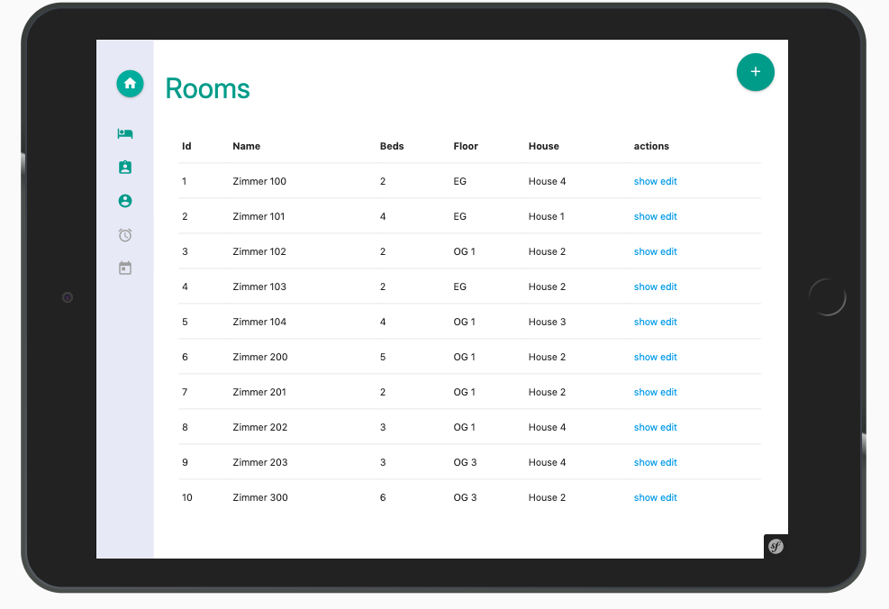
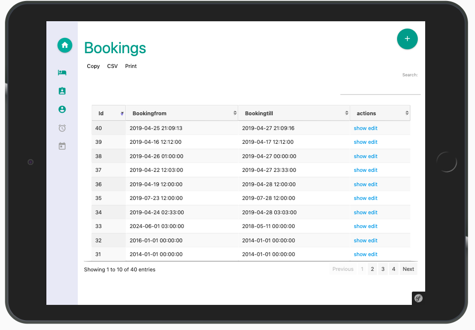
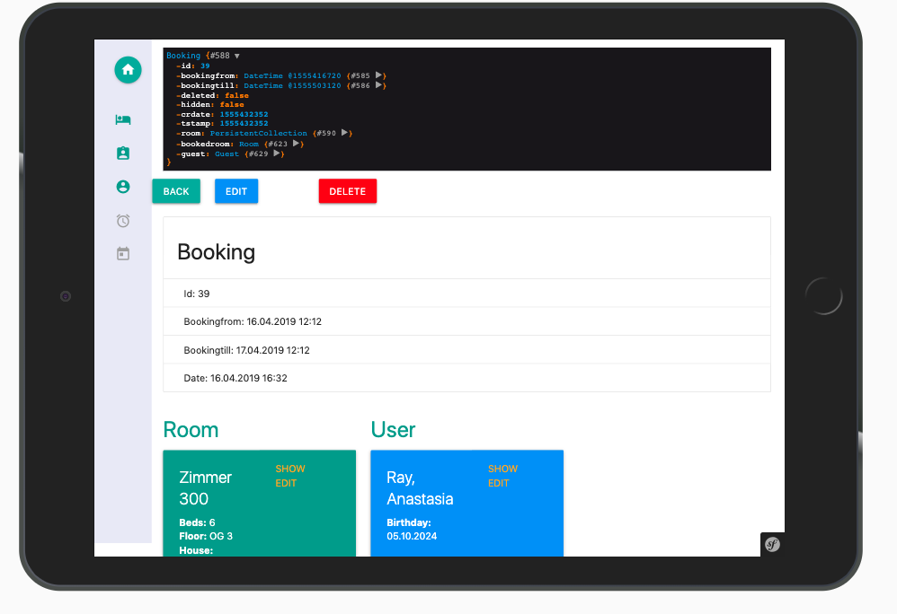
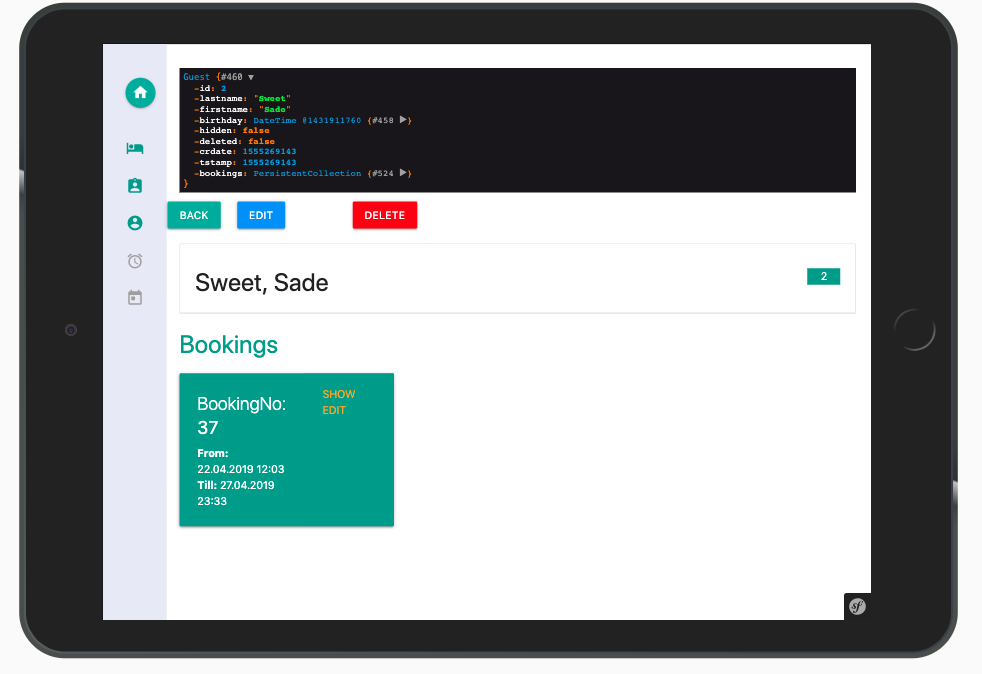
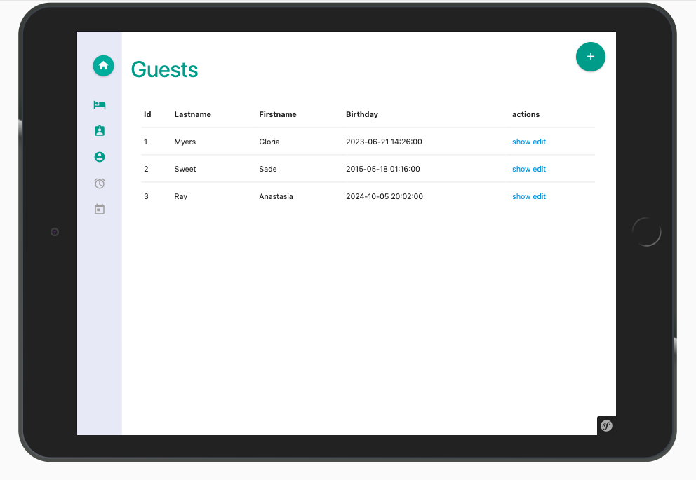
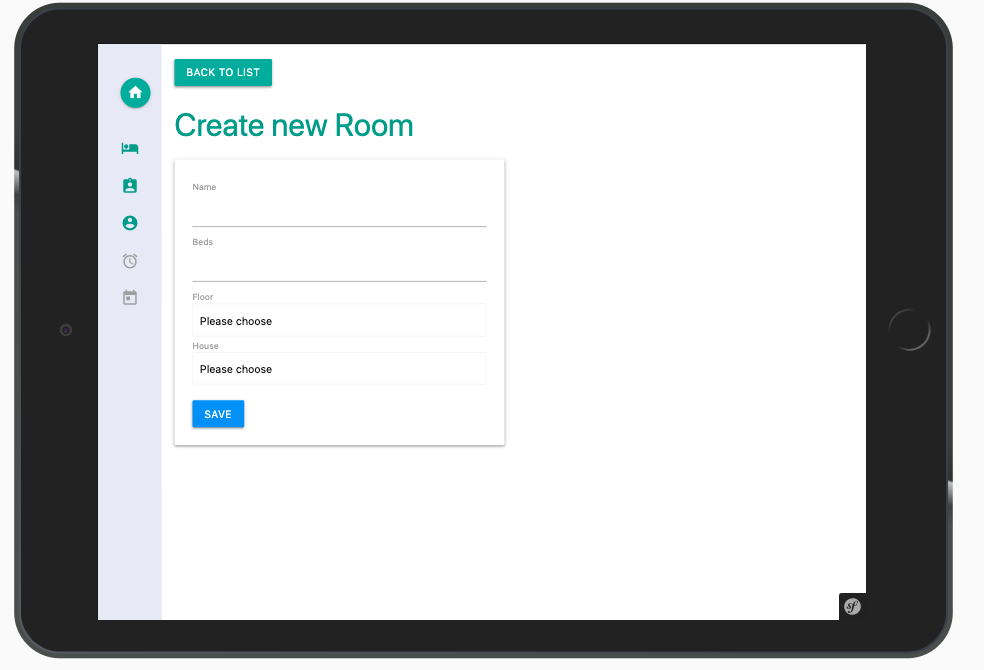
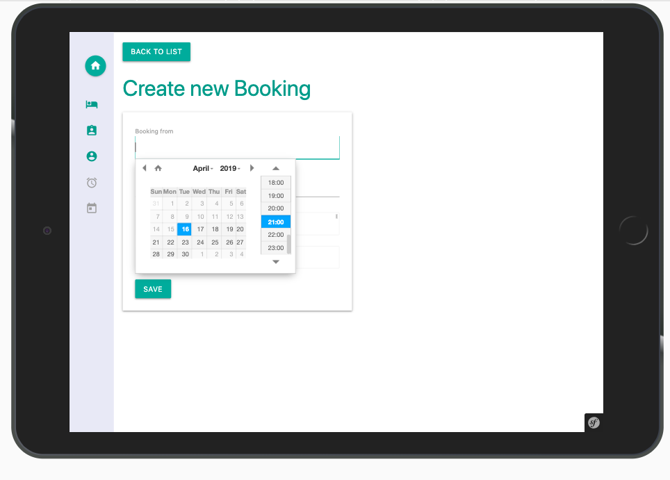
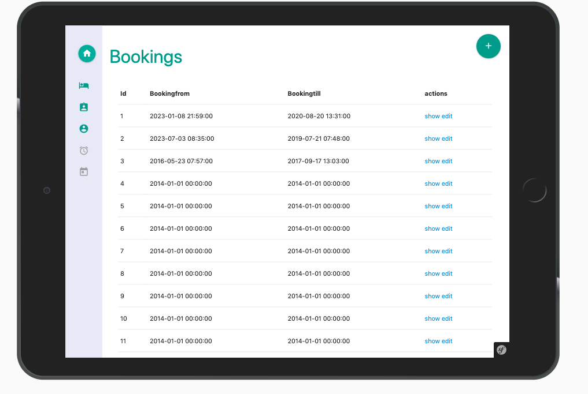

# Booking Software
Official booking application.

## Symfony
* Creating Entities: https://symfony.com/doc/current/doctrine.html
* Creating CRUD: https://symfony.com/doc/master/bundles/SensioGeneratorBundle/commands/generate_doctrine_crud.html

## Server

### Todos

## Basic steps
* Plain App erstellen: composer create-project symfony/skeleton amazonapp
* Server installieren: composer require server --dev
* Server starten: php bin/console server:run
* Asset Watch: yarn run encore dev --watch

### Demo
* https://material.io/develop/web/
* https://dribbble.com/shots/6321346-Mission-Control-Full-view/attachments
* http://preview.themeforest.net/item/material-design-admin-with-angularjs/full_screen_preview/13582227

### Commands
* composer create-project symfony/website-skeleton
* php bin/console server:start 0.0.0.0:8000

#### Screens

 

 
 