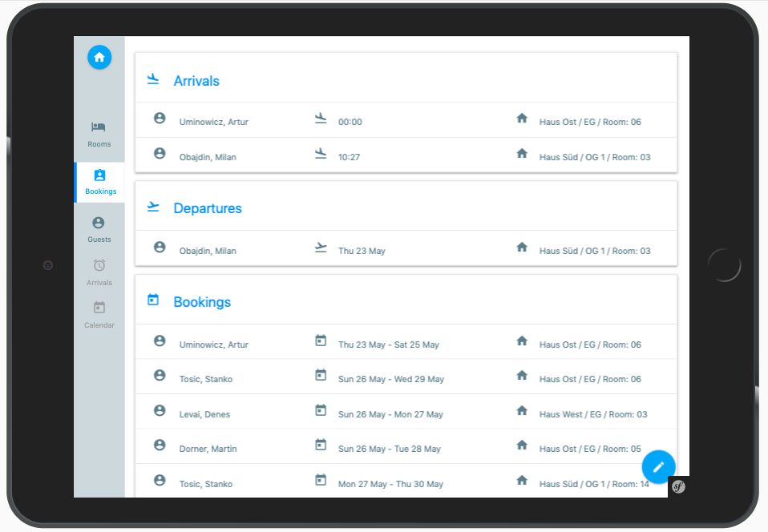
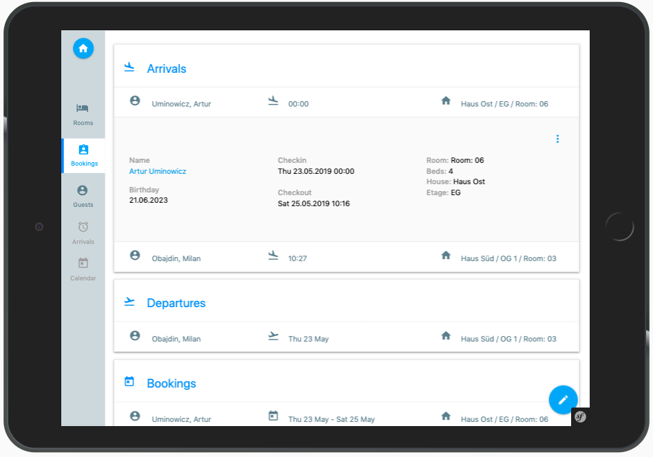
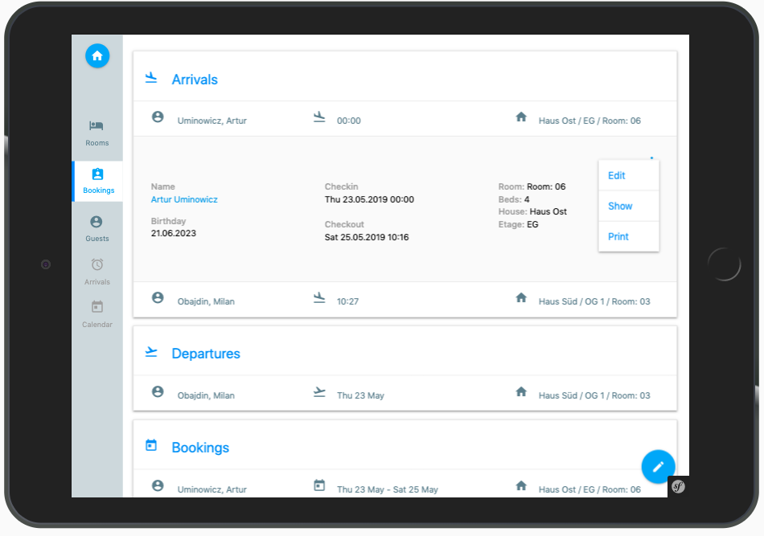
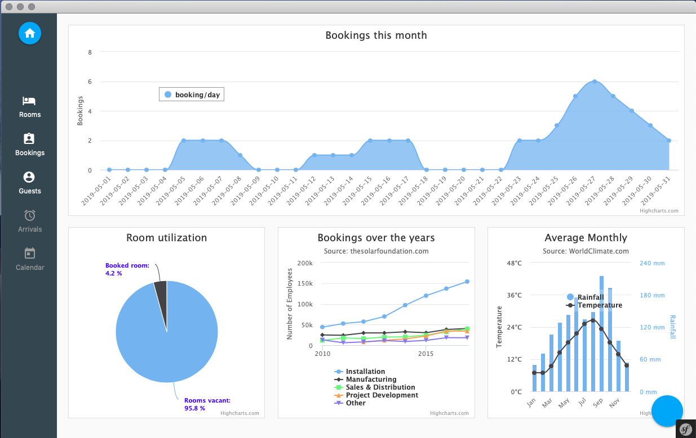
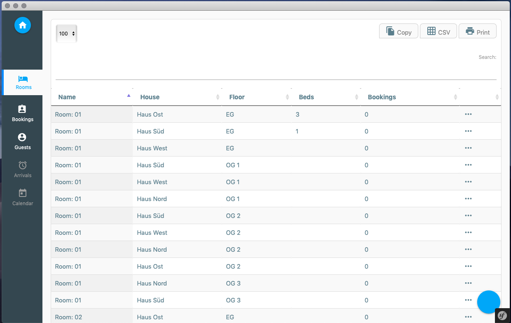
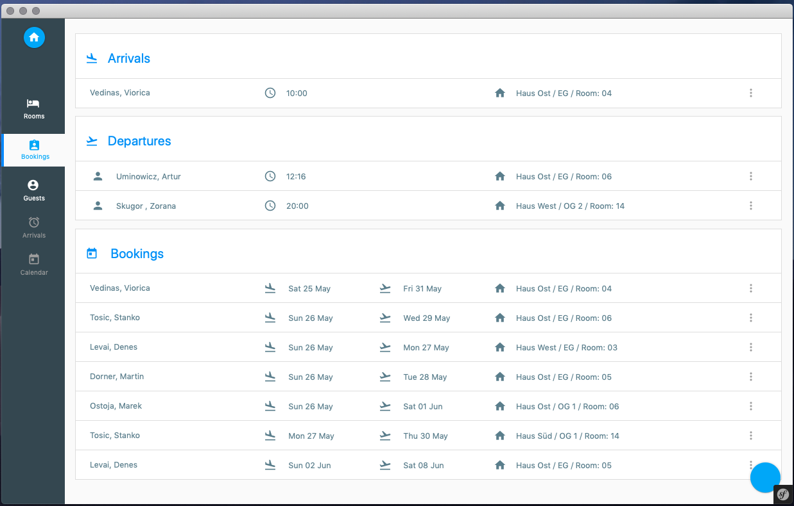
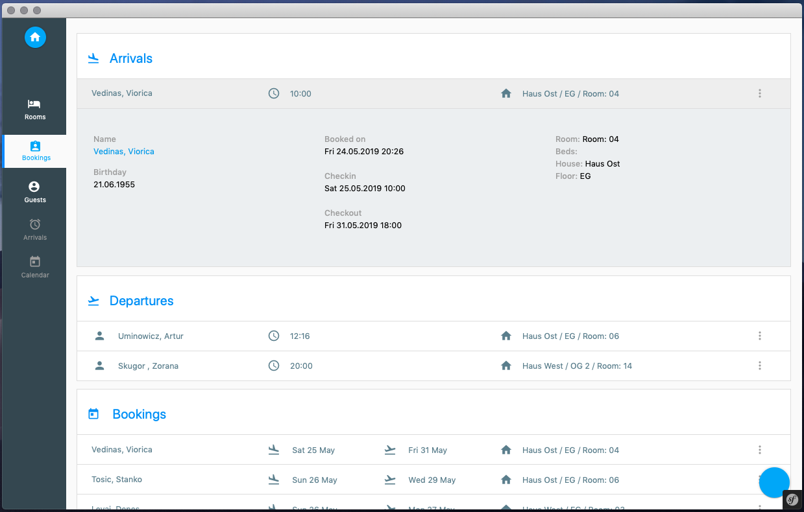
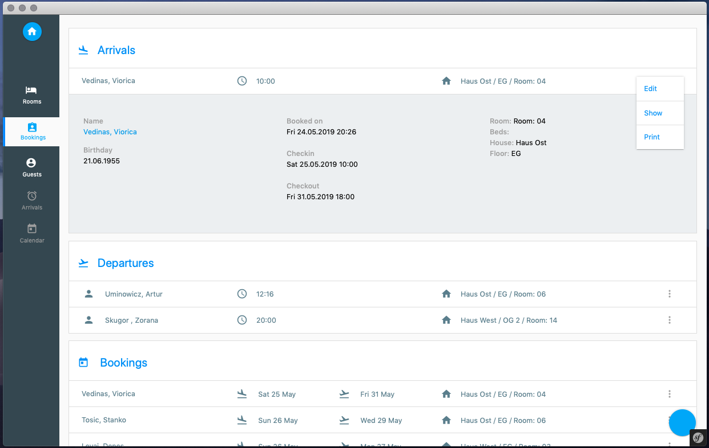
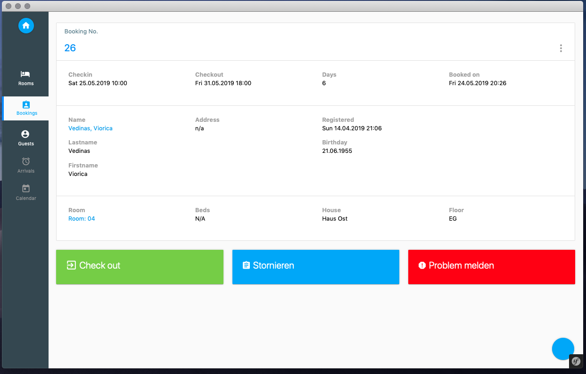
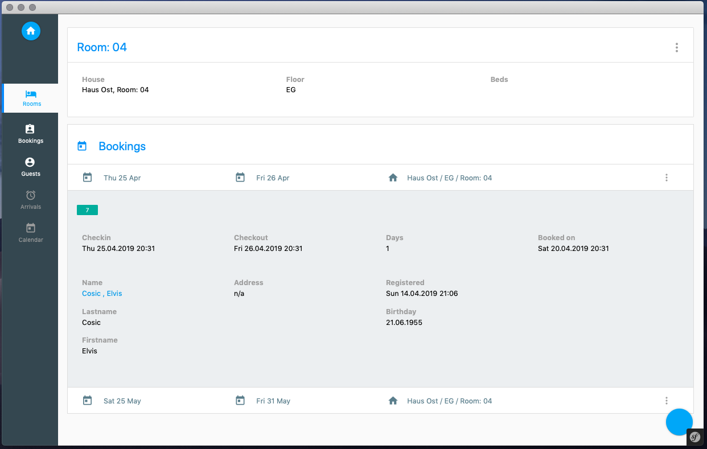

# Hotel Booking Software
This is an easy-to-use hotel booking software application. You can manage your bookings of your rooms and houses.

## System and setup
* Symfony Framework ```v. 5.x```


## Installation
* Clone respository ````git clone git@github.com:dkoehl/booking.git````
* Install application via ````composer install````
* Install assets with ```yarn install```


## Labels and Messages
Path to the Labels/Languagefile: `translations/messages.xlf`

{{ '`booking.headline`'|trans }}

### Demo
* <https://material.io/develop/web/>
* <https://dribbble.com/shots/6321346-Mission-Control-Full-view/attachments>
* <http://preview.themeforest.net/item/material-design-admin-with-angularjs/full_screen_preview/13582227>
* <https://materializecss.com>


#### Screens











 

 
#### Links
* https://www.setasign.com/products/fpdi/demos/simple-demo/#p-249.60000610351562
* https://printjs.crabbly.com/


#### Contact
You can contact me Twitter: @denniskoehl
